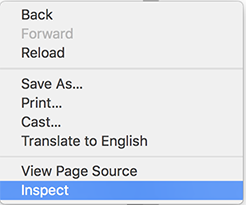
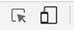
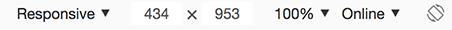

This week's homework is building a responsive page.

## You will learn this homework

* Add create a flex box layout
* Add media queries to ensure it works on both desktop and mobile
* Add responsive images so the page loads fast on mobile

## Getting started

Download the starter file and unzip the folder.

In the folder you will find an HTML page and a CSS file.  You will need to link them together to get basic styles.

### Create two column layout

We will use flexbox to create a two column layout.  Since the HTML is in place we will just need to update the CSS.

Add new `row` selector

```css
.row {
  display: flex;
}
```
Set the "widths" of the columns.  Add the properties below to the existing selectors.

```css
.content {
  flex: 1;
}
.side-bar {
  flex: 0 1 30%;
}
```
Now we want to ensure the full page is filled to do this we are going to set a flex box on the `.container`.  Before we do that we need to set the height of the document to at least `100%`;

Add this to the top of the css file

```css
html, body {
  min-height: 100%;
}
```
Then update the container to this (remember to keep any unchanged properties).

```css
.container {
  max-width: 1000px;
  min-height: 100vh;
  display: flex;
  flex-direction: column;
}
```

Now we want git all the extra space to the `.row`.   Remember an element can be both a flex parent and flex child.

```css
.row {
  flex: 1;
}
```

### Add Responsive

Now open up the chrome dev tools by right click and select "inspect element"



Then toggle the mobile view



and select responsive from the drop down and resize to be `510px` wide (you can also set the width in the box to the right of the dropdown).



Notice that everything looks bad so need to add some media queries.

The nav styles will not work at small screen sizes so we want to make it so the only display when the screen width is greater than `510px`. To do this we want to wrap all the selectors that has `.main-nav` with this.

```css
@media screen and (min-width: 511px) {
  /* all selectors that have .main-nav */
}
```
This will remove all the styles for the `.main-nav` when the screen is `510px` or below.  Try changing the width to something larger than `510px` and notice the styles come back.

Next we need to create a media query to change the styles to work at the small screen size.

add this at the bottom of the css file

```css
@media screen and (max-width: 510px) {

}
```
Now we need style the `.main-nav` by adding these styles.  Remember to place with the new media query we just added.

```css
.main-nav ul {
  margin: 0;
  padding: 0;
  list-style-type: none;
  background-color: slategray;
}

.main-nav a {
  display: block;
  padding: .5em 1em;
  color: snow;
  text-decoration: none;
  border-bottom: 1px solid snow;
}
```
Now the the nav is fixed we need to fix the two columns and change them to be a single column.  We can do that by changing the `flex-direction`

```css
.row {
  flex-direction: column;
}
```
Now we need to change the related content in the `.side-bar`. add these styles.

```css
.media-object {
  flex-direction: column;
}

.media-object img {
  max-width: 100%;
}

.media-object .info {
  margin-left: 0;
  margin-top: 0.5em;
}
```
Now we want to change the order of the elements to place the at the bottom of the page.

Add this to the media query and update any existing styles.

```css
.top-header {
  order: 1;
}

.main-nav {
  order: 3;
}

.row {
  order: 2;
}

.footer-section {
  order: 4;
  background-color:  darkslategray;
}
```

This will look good on any mobile device but change the size to an iPad and notice that the top nav does not look great.

Add this new media query be sure to add it **before** the `510px` query.

```css
@media screen and (max-width: 768px) {
  .main-nav a {
    letter-spacing: 0;
  }
}
```

### Adding picture element

We have fixed all the styles but the images are not correct at the small size.

There is a small version of every image.

Update the html to use the picture element. Follow this template the small src should be placed in the `<source>` like below.

```html
<picture>
  <source media="(max-width: 510px)" srcset="images/hero-sm.jpg">
  
</picture>
```
[Final View](https://codepen.io/danhahn/full/PyRLvM/)