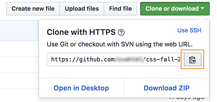
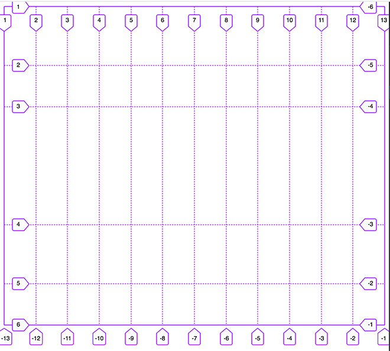
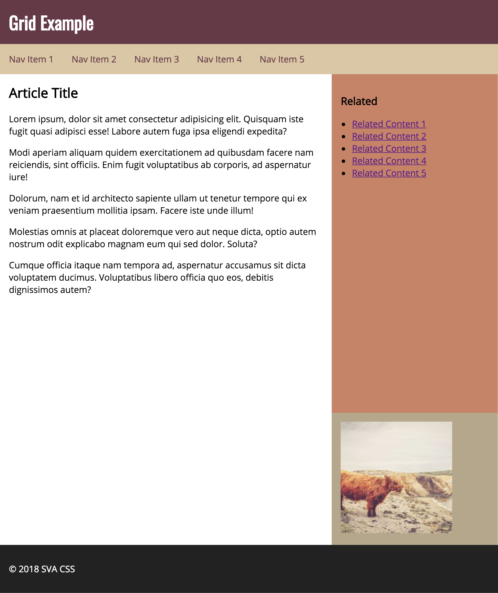

This weeks homework is going to review the css grid from last lesson.

## We will cover

1. Create a grid
2. Place items on the grid
3. Add a flex box for the nav

## Getting started

For this homework we are going to send the homework via github.  Make sure you have git installed on your local computer and you clone your project to your local hard drive.

Click the `copy` button from your github repo.



**Note:** do not click the "Download Zip" button it will not work in this case.

Open your terminal and run this command.

```command
cd Documents
git clone https://github.com/your-repo/css-fall-2018.git
cd css-fall-2018
```

Download the starter file and unzip it and put it in a `homework` folder then run `git add .` to add the files to your project.

When you are done commit the final changes and send me your github repo link.

## CSS Changes

We need to create a grid that is has 12 columns and 5 rows.



* columns should be `1fr`
* rows should be `auto` `auto` `1fr` `auto` `auto`;
* header should span all 12 columns
* nav should span all 12 columns
* content area should span 9 columns and 2 rows
* sidebar should span 3 columns
* "spot" should span 3 columns
* footer should span 12 columms

## adding flex box

Since you can use both flex and grid lets add a `display: flex` to the `.nav` selector.


## Finished Project


Your final project should look like this when you are all done.
