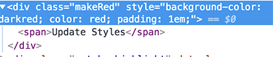

There are many ways that we can update the DOM.  If we want to update existing DOM elements we will use one of the query selector.

## Update text

One of the most common things we want to do is update test of an element.

To do this we will use

* `innerText`
* `textContent`

### Differences from innerTextSection
Internet Explorer introduced node.innerText. The name is similar but with the following differences:

* While textContent gets the content of all elements, including `<script>` and `<style>` elements, `innerText` does not, only showing “human-readable” elements.
* `innerText` is aware of styling and won’t return the text of “hidden” elements, whereas `textContent` does.
* Since `innerText` takes into account CSS styling, reading this property triggers a reflow, ensuring up-to-date computed style. `textContent` doesn’t. Reflows can be computationally expensive thus should be avoided when possible.

### html

```html
<div class="inner">
  <h1></h1>
</div>
```

#### Try it

<div class="inner">
  <h1></h1>
</div>

### js

```javascript
var h1 = document.querySelector('.inner h1');
h1.innerText = "This was set by the innerText";
// or
h1.textContent = "This was set by the textContent";
```

We can also update the text that is already there.

### html

```html
<div class="update">
  <h1>Current Header</h1>
</div>
```

#### Try it
<div class="update">
  <h1>Current Header</h1>
</div>

### js

```javascript
var h1 = document.querySelector('.update h1');
var h1Text = h1.textContent;
h1.textContent = h1Text + " Updated";
```

## Update CSS

JavaScript also allows you to update the CSS on a DOM element by accessing the `style`.

**Note:** properties that have a hyphen in them will be camel cased like `background-color` becomes `backgroundColor` in javascript.

### html

```html
<div class="makeRed">
  <span>Update Styles</span>
</div>
```
#### Try it

<div class="makeRed">
  <span>Update Styles</span>
</div>


```javascript
var div = document.querySelector('.makeRed');
div.style.backgroundColor = "darkred";
div.style.color = "red";
div.style.padding = "1em";
```

This will add the styles to the element via an inline style block.



When setting the value you will always set them a string.

## Update Classes

We don't write our css in inline style blocks because they are not reuseable.  JavaScript allows us to add or remove css class names by using `classList`.

* `add()` - adds a class to to the class list
* `remove()` - removes a class from the class list
* toggle() - toggles a class from a class list.

### html

```html
<div class="addClass"></div>
```
#### Try it

<div class="addClass"></div>

```javascript
var div = document.querySelector('.addClass');
div.classList.add('active');
console.log(div); // <div class="addClass active"></div>
```

Notice how there are now two classes.

```html
<div class="removeClass"></div>
```
#### Try it

<div class="removeClass"></div>

```javascript
var div = document.querySelector('.removeClass');
div.classList.add('removeClass');
console.log(div); // <div class></div>
```

The class attribute is still defined but not set.

## Adding Event Listener

Up to this point all the event that happen happen the script is run by browser.  There is no way to run the code when we want.  That is where an event listener comes in to play.  We can wait for an event to happen before the code is run.

[See All the event types](https://www.w3schools.com/jsref/dom_obj_event.asp)

Lets work with a button and run a script when the button is clicked.

```javascript
function buttonClicked() {
  console.log('button clicked');
}
```

### Old school way

The way we would have done this 20 years ago would have been to update the html with an `onClick` that would run the function.  This is not the way we do it anymore because if we add it after the fact it gives us much more control over the way the function is called.

```html
<button onclick="buttonClicked()">Click Me</button>
```
#### Try it

<button onclick="buttonClicked()">Click Me</button>

This gives un an error in the console if we click it.

### New School

### html

```html
<button id="clickMe">Click Me</button>
```

### js

```javascript
var button = document.querySelector('#clickMe');
button.addEventListener('click', () => {
  console.log('clicked');
});
```

Now if we click the button it will write "clicked" to the console.

Alot of the time we want to break the function called out from the event it might look like this.

```javascript
function logClicked() {
  console.log('clicked from a function');
}

var button = document.querySelector('#clickMe');
button.addEventListener('click', logClicked);
```

this will do the same thing but is a little more clear.


