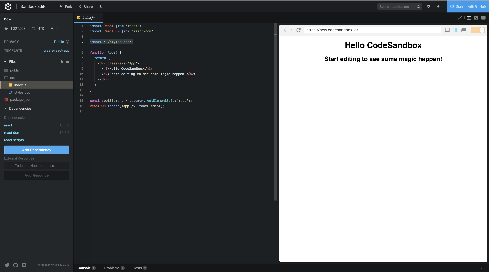

Up to this point we have created simple html pages but they are not full app and it should not be use in a production.

We need to start to think about build build environment.  One of the things we will need to do is bundle the all the javascript and css files together.  We will use webpack to do this.

We also need to start to run a server to serve the files we will use node for this. More on this in a bit.

## Getting started

Code sandbox is site that a will do all the build environment for us.  It will allow us to use webpack and react with having to do any of the configuration.  

https://codesandbox.io/

You can use your github account to login.

Click the "Create Sandbox" button.  This will bring you to a list of js libraries.   We want to choose "React".

This will create a stand alone app that will help us understand how an app in react works.

## NPM

NPM or node package manager is how we will add packages or pre written code in to our app.  There are thousands of packages that are free to use and we will more as we go along.

When you use NPM you will create a `package.json` file.  This file will contain all packages you need to install as well as any scripts that might need to be run.

```javascript
{
  "name": "new",
  "version": "1.0.0",
  "description": "",
  "keywords": [],
  "main": "src/index.js",
  "dependencies": {
    "react": "16.5.2",
    "react-dom": "16.5.2",
    "react-scripts": "2.0.3"
  },
  "devDependencies": {},
  "scripts": {
    "start": "react-scripts start",
    "build": "react-scripts build",
    "test": "react-scripts test --env=jsdom",
    "eject": "react-scripts eject"
  },
  "browserslist": [
    ">0.2%",
    "not dead",
    "not ie <= 11",
    "not op_mini all"
  ]
}
```

Notice the `"main": "src/index.js",` this tells us the first file that is run.

## Import Files

One thing that has changed with JavaScript is we are able to import and export files.  This allows us to have more smaller file that are put together.

```javascript
import React from "react";
import ReactDOM from "react-dom";
```

Here we are importing to packages `React` and `ReactDom` and the can be used anywhere within this file.

But we can also just import a file that should be added the page when it render.

```javascript
import "./styles.css";
```
The contents of `styles.css` will be added to the rendered page.

## React

After that we should have seen all the react stuff before.  

