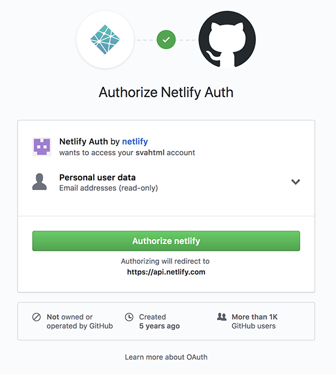

Code sand box is great for getting started but may not be where we want to work long term.

So we need to export the app out.

When you click the "download" button it  will download a zip file will the the files you need to work.

## Getting missing files

Since we have a `package.json` file all the file in the "node_modules" folder are not included in it.  We need to add them back.

Lets unzip the file that was exported and open it in VS Code.  Then open the terminal.

From the command line in the terminal run this command

`npm install`

This will download all the files needed to run the app.

## Starting the App

We need to run the app locally to do that we need to fun this

`npm start`

Keep that running you can view it at

`http://localhost:8000`

To stop the server press

`control + c`

## Hosting your application

Once you are done with your application you need to host it some where.  If you have your own host you can use it but it becomes a very manual work and open to errors.

There is a great server called https://www.netlify.com/ who offer great free hosting.  In fact our class site is hosted there.

You will need to create an account but the cool thing is you can just login with your github account so it is super easy.

When you log in you will be prompted with a screen like this.

Click the button and you are all set.

## Building the code

We need to run one more script before we can host the file.

Back in VS Code make sure the server is not running by pressing `control + c`.

Then run this command

`npm run build`

This will build file the files that will be uploaded to Netlify.

You will need to upload the "build" folder.

Thats it you now have an app on the internet.

